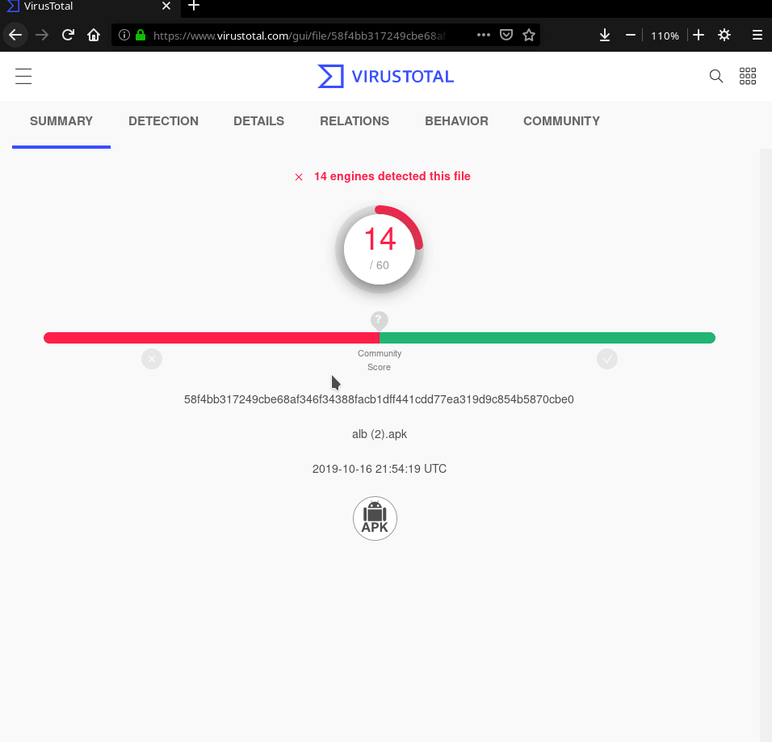

# firefox-playstore-extention

Select the text. Right click. Click on `open in play store`

or copy text and press `Ctrl+Shift+U` ( you can change shortcut at Addons => Manage Extention Shortcuts ) 

#Basic usage :

